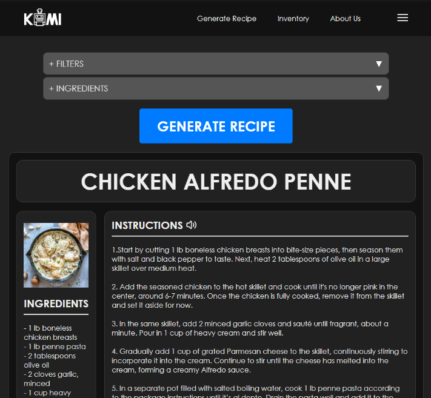
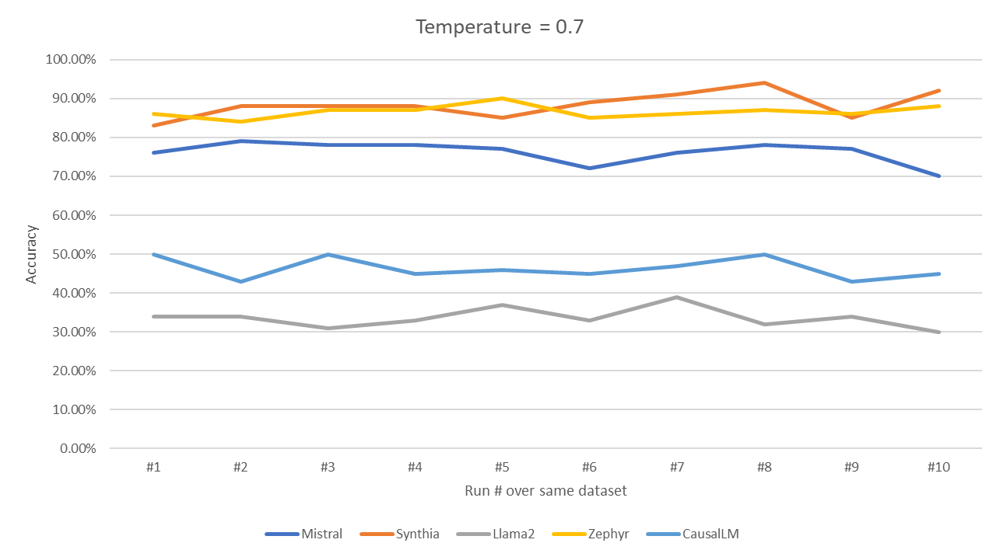
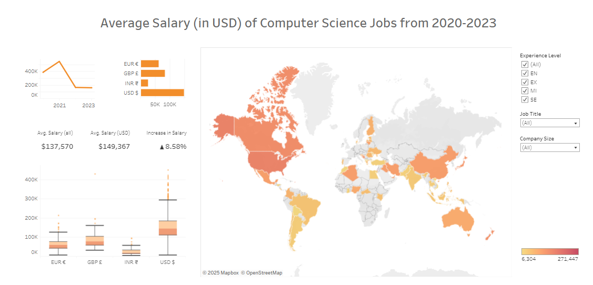
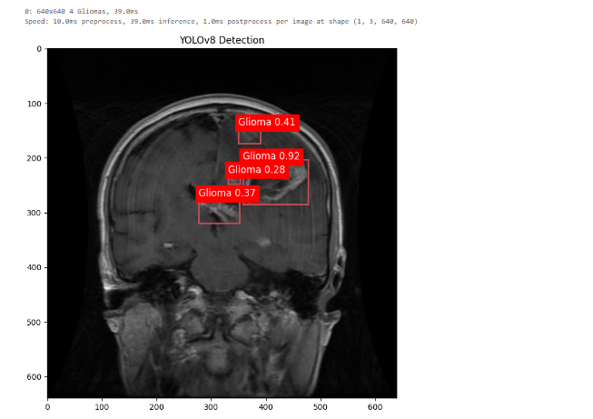
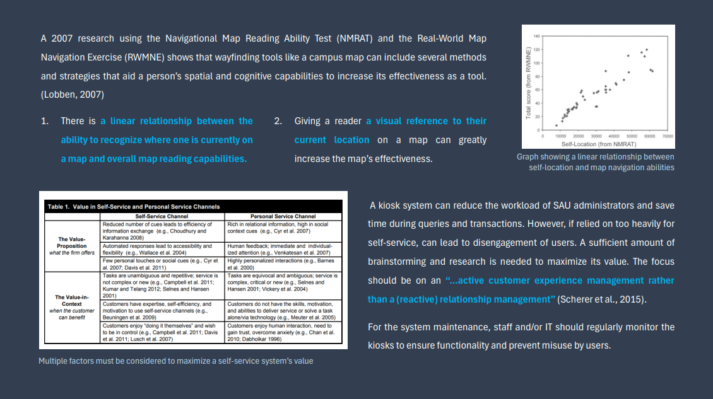
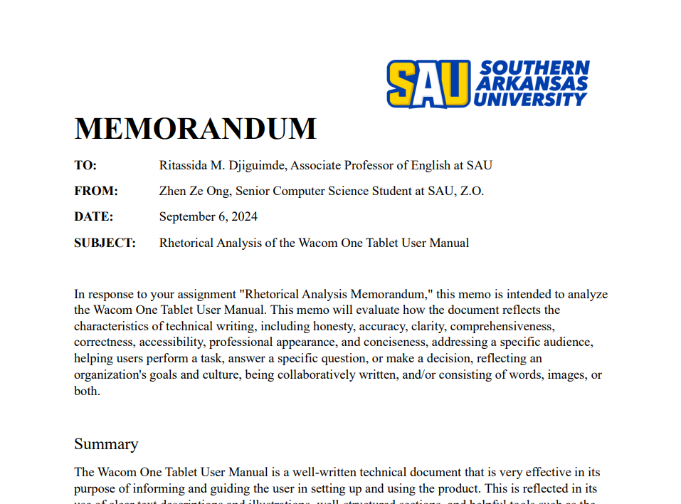

# **Hello there, I'm Justin!**

### Developer/Artist/Creator

> I am an aspiring data analyst with entry-level professional experience in application development. I mainly work with Python, Java, and C++ in various personal and academic projects. I graduated from Southern Arkansas University with a major in Computer Science and a minor in Mathematics. I enjoy collaborating with people and creating ideas!

### Find me on:

&nbsp;&nbsp;

&nbsp;&nbsp;

# ---

## **Work Experience**

### App Dev Intern @ J.B. Hunt Transport

**2024**  
**Lowell, Arkansas, United States · On-site**

- Participated in multiple 2-week sprints with a full-time backend team.  
- Updated and maintained the 360 Shipper application.  
- EUM calls cleanup, removing and replacing legacy code with modern APIs.  
- Application was based on a Java Spring Boot framework.  
- Collaboration through Azure DevOps Services with Git.  
- Utilized Postman API and Dynatrace to test services.  

In this paid, in-person internship, I participated in multiple 2-week sprints with a full-time backend team. We focused on updating and maintaining the 360 Shipper application, where I was assigned stories on EUM calls cleanup, removing and replacing legacy code with modern APIs.

The application was based on the Java Spring Boot framework, and we used Git requests to collaborate through Azure DevOps Services. We also utilized Postman API and Dynatrace to test our services.

&nbsp;

### CS Research Assistant @ Southern Arkansas University

**2022-2024**  
**Magnolia, Arkansas, United States · On-site**

- Assisted in several research projects with a focus on machine learning.  
- Object detection/classification.  
- Worked with ViT (vision transformers) and YOLOv8.  
- Utilized Python tools in projects.  
- Image/label dataset cleanup.  

I assisted in several machine learning research projects, specifically ViT (vision transformers) object detection. Python and its libraries (Tensorflow, Keras, PyTorch, CUDA) were utilized for our projects.

&nbsp;

### Peer Tutor @ Southern Arkansas University

**2022-2024**  
**Magnolia, Arkansas, United States · On-site**

- Worked as an in-person supplementary tutor.  
- Provided tailored support to individuals who required assistance in mastering their course material.  
- Computer Science, Math, Physics, and English.

In the Academic Enrichment Center, I worked as an in-person supplemental tutor to peers, providing tailored support to individuals who required assistance in mastering their course material. This role trained my communication and leadership skills.

# ---

## **Projects**

### KAMI (Kitchen Assistant and Meal Innovator) - AI Recipe Generator

This capstone project's main focus was to make an AI-based recipe generator that functions by feeding it with available ingredients and establishing limits or constraints to the dish. We integrated this into a website that 'invents' new recipes by considering the user's dietary needs and choice of cuisine.

The recipe's ingredients, instructions, and AI-generated image are displayed to the user. The project implemented OpenAI's GPT-4 and DALLE-3 APIs into a Django Framework that is connected to a local MySQL database.

<a href="pdfs/KAMI Report.pdf" target="_blank">[Read more]</a>

&nbsp;

### LLM SPAM or HAM Classification

As an Honors project for my Cyber Forensics class, I decided to test the ability of different LLMs (Large Language Models) to classify spam emails in a zero-shot environment. Five models—Llama2, Mistral, Synthia, Zephyr, and CausalLM—were given the same dataset of spam and ham emails and instructed to classify them accordingly.

I downloaded and hosted the models on LM Studio and used the OpenAI API to connect them to a Python .ipynb notebook.

<a href="pdfs/Harnessing AI Cognition.pdf" target="_blank">[Read more]</a>

# ---

## **Skills**

### Data Visualization

The following is a simple interactive data visualization of the wages of computer science jobs between 2020-2023. I created this while learning and experimenting with Tableau.

As a research assistant, I had to explore different ways of visualizing data. I utilized Python libraries and Jupyter Notebook during our machine learning projects.

### Technical Writing

I believe that technical writing skills are vital in the Computer Science field, to report documents professionally. I have written some technical documents outside of my CS projects to develop these skills.

  

<a href="pdfs/ProjectMemorandum.pdf" target="_blank">Sample Memorandum</a>  
<a href="pdfs/ProjectRecommendationLetter.pdf" target="_blank">Sample Recommendation Letter</a>  
<a href="pdfs/ProposalKiosk.pdf" target="_blank">Sample Proposal</a>

# ---

## **Education**

### Southern Arkansas University

Bachelor of Science in Computer Science: Cyber Security and Privacy Option, Minor in Mathematics, 4.00GPA

Honors College, International Students Association

# ---

## **Other things about me**

In my free time, I like do digital art and animations. Creative projects have always been my interest.

I had a lot of fun designing the logo/mascot of my team's capstone project in my Senior year, where I even created a .gif animation consisting of 16 hand-drawn frames.

<!--  -->

<!--  -->

Animation frames:

Other examples of my digital art works that were created through Clip Studio Paint, a digital graphics software:

  
  
