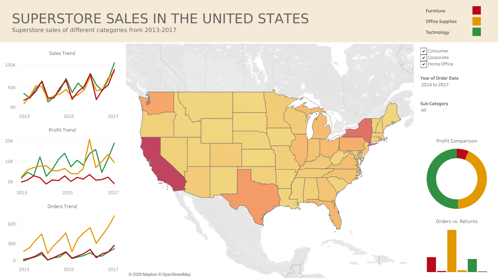

# **Hello there, I'm Justin!

### Data Analyst

### Find me on:

&nbsp;&nbsp;

# ---

## **Summary of Skills**

**Programming Languages:** Python • Java • SQL • C++ • HTML • CSS • JavaScript • TypeScript   
**Frameworks:** Pandas • NumPy • scikit-learn • Keras • Matplotlib • Spring Boot
**Tools:** Power BI •  Power Query •  Power Automate •  Excel •  Visio •  Tableau •  MySQL •  Postman
**IDEs:** Jupyter Notebook •  Visual Studio Code •  PyCharm •  IntelliJ IDEA •  Code::Blocks
**Soft Skills:** Project Management •  Technical Writing •  Collaboratiion •  Transformation & Automation

# ---

## **Work Experience**

### Data Analyst @ The Estée Lauder Companies Inc. [Dec 2025 - Present]

I build and enhance dashboards while maintaining their data pipelines.

What I do:

- Build and enhance Power BI reports for various stakeholders.
- Create and maintain data pipelines.
- Automate manual data upload processes.
- Document onboarding and process guides, detailing dashboard data sources and report navigation.

&nbsp;

### HR Analyst Intern @ The Estée Lauder Companies Inc. [Apr 2025 - Nov 2025]

In this internship, I led development for multiple RPA projects, reducing thousands of manual tasks into quick and effective automation processes. I also had my first experience working with real industry data, pipelining raw data into fine-tuned dashboards for management-level teams.

What I did:

- Develop and maintain RPA (robotic process automation) projects for HR Services using Power Automate.
- Work closely with intern partner and supervisor to discuss solutions for automation projects.
- Collaborate with the team's data analyst to extract and pull data from company database.
- Meet with internal stakeholders for RPA proposal and development.
- Document RPA BRD and user guides, detailing bot processes and instructions for future maintenance. 
- Present RPA utilization and development to global leads.
- Conduct Power BI demo and training to other teams.

Notable Achievements:

- Won the FY25 Freshman Hero Award for outstanding first-year performance.
- Lead development of 14 RPA projects, saving an estimated 2,800+ hours annually.
- Built 12 Power BI dashboards used by APAC leads on a daily basis. They highlight employee demographics, attrition/turnover rates, and leave balances,
- Reduced processing time of HR administrative applications (leave, commuting allowance, requests, etc.) for the Japan office by 87.5% using automation.
- Built a new hire onboarding system with automated Teams event scheduling and emailing.
- Automated the reading and processing of hundreds of documents for XML bulk stamping, reducing administrative work by 80%.

&nbsp;

### CS Research Assistant @ Southern Arkansas University [Sep 2022 - Dec 2024]

I assisted in several machine learning research projects, specifically ViT (vision transformers) object detection. Python and its libraries (Tensorflow, Keras, PyTorch, CUDA) were utilized for our projects.

What I did:

- Developed object detection and classification models with ViT (Vision Transformers) and YOLOv8.
- Worked with my professor in research studies and applications for machine learning methods.
- Used Jupyter Notebook and Python (NumPy, Pandas, Matplotlib, etc.) for data ETL and analysis.
- Explored computer vision methods on medical records like brain tumor and chest classification.
- Explored different multi-label classification strategies and image enhancement techniques.
- Presented findings on TDA (Topological Data Analysis) at the 2023 DART Annual Conference.

&nbsp;

### Peer Tutor @ Southern Arkansas University [Aug 2022 - Dec 2024]

In the Academic Enrichment Center, I worked as an in-person supplemental tutor to peers, providing tailored support to individuals who required assistance in mastering their course material. This role trained my communication and leadership skills.

What I did:

- Worked with fellow tutors to support students in mastering course material and exam preparation.
- Customized teaching strategies to meet individual student needs and learning habits.
- Tutored computer science, math/algebra/calculus, physics, English.
- Assisted with campus- and class-related inquiries and issues.
- Managed inventory of calculators and stationery for the tutoring center. 

&nbsp;

### App Dev Intern @ J.B. Hunt Transport [May 2024 - Jul 2024]

[Internship Report](assets/pdfs/InternshipReport.pdf) • [Internship Slides](assets/pdfs/InternshipSlides.pdf) • [Presentation Video](https://use.vg/eiFiHm)

In this paid, in-person internship, I participated in multiple 2-week scrum sprints alongside a full-time backend team. We focused on updating and maintaining the 360 Shipper application, where I was assigned stories on EUM calls cleanup, removing and replacing legacy code with modern APIs.

The application was based on the Java Spring Boot framework, and we used Git requests to collaborate through Azure DevOps Services. We also utilized Postman API and Dynatrace to test our services.

What I did:

- Maintained a shipment booking and tracking app in a Java framework.
- Participated in daily standups, sprint planning, and retrospectives of a full-time team.
- Collaborated with intern partners and full-time mentors both on-site and remotely.
- Refactored legacy code and removed unused endpoints.
- Recharted APIs in existing services by replacing outdated EUM calls.
- Used Postman API and Dynatrace for HTTP request testing.
- Used Azure DevOps Services with Git for version control.
- Attended multiple company-hosted events, gaining insights into the logistics industry.

# ---

## **Education**

### Southern Arkansas University [Jan 2021 - Dec 2024]

Bachelor of Science in Computer Science: Cyber Security and Privacy Option, Minor in Mathematics, 4.00GPA

Honors College, International Students Association

Academic activities:
- 2024-2025 Outstanding Student of the Math and Computer Science Department
- President's list 2021-2024
- Presented at the First CSE Undergraduate Research Conference (2022)
- Presented at the Third CSE Undergraduate Research Conference (2024)

Extracurricular activities:
- Participant of the 2024 Hedrix College Programming contest
- Mulerider Esports captain/player (Valorant) from 2023-2024
- International Student Association activity organizer from 2021-2022 
- Volunteer for Paws on the Malls

On-campus jobs:
- Research assistant for Math and Computer Science Department from 2022-2024
- Peer tutor at the Academic Enrichment Center from 2022-2024 

# ---

## **Projects**

### 1. Spotify Wrapped in Power BI

 [GitHub Repo](https://github.com/aJustinOng/spotify-wrapped-power-bi)

**Skills:** Data ETL • Data Visualization • DAX • 3rd Party Web API

**Tools:** Power BI • Power Query

**Overview:**

Spotify Wrapped is a popular online phenomenon that pops up every year, but it is inherently incomplete, as data is often cut by mid November to generate the summary before the year ends. In this project, I reconstructed and customized Spotify Wrapped using Spotify’s provided personal data and public Web API, producing a extensive view of the classic report that can span multiple years.

Using Power Query, tens of thousands of streaming records are ingested from raw, local JSON files and transformed into a structured semantic model. After basic cleaning, unique track and artist identifiers are grouped into controlled batches to be queried to the [Spotify Web API](https://developer.spotify.com/). Through the Web API, the model can obtain additional resources like album and artist images and genre information. To prevent exceeding rate limits, the most relavant tracks and artists are targeted and grouped for batch querying, reducing ~25000 single queries to just 33 API calls.

The result is a fully reproducible, end-to-end analytics pipeline that combines raw data, API-based enrichment, and analytical modeling to recreate — and extend — Spotify Wrapped with greater accuracy, completeness, and analytical flexibility.

**Note:** According to [official Spotify documentation](https://developer.spotify.com/documentation/web-api), API calls in the future will require a premium Spotify account.

&nbsp;

### 2. Hobbit Face SVM Classifier

> If most of us valued food and cheer and song above hoarded gold it would be a merrier world. — J.R.R. Tolkien

 [GitHub Repo](https://github.com/aJustinOng/hobbit-classifier)

**Skills:** Python • NumPy • Pandas • Matplotlib • OpenCV • PyWavelets • scikit-learn • Keras • HTML • CSS • JavaScript

**Tools:** Jupyter Notebook • VS Code • PyCharm • Flask

**Overview:**

This project explores whether a machine learning model can distinguish between actors who portrayed Hobbits in The Lord of the Rings. Because the actors share similar visual traits, the task serves as a fine-grained face classification challenge.

I scraped images online of Elijah Wood, Sean Astin, Billy Boyd, Dominic Monaghan, and Martin Freeman that were ingested into a Jupyter Notebook setup. Faces were detected and cropped using OpenCV Haar cascades, and low-quality images were filtered out. The initial model used a traditional pipeline with wavelet feature extraction and an SVM classifier, tuned using GridSearchCV. The trained model was deployed via a Flask backend and a simple web interface that supports image uploads, multiple face detection, and confidence-based predictions.

To improve performance, the SVM was replaced with a Convolutional Neural Network trained directly on raw face images. After 20–30 epochs, the CNN achieved a ~20% improvement in accuracy over the original approach.

The final system demonstrates the effectiveness of CNNs for distinguishing visually similar faces in a real-world classification setting.

&nbsp;

### 3. Real Estate Price Prediction

 [GitHub Repo](https://github.com/aJustinOng/real-estate-price-prediction)

**Skills:** Python • NumPy • Pandas • Matplotlib • scikit-learn • HTML • CSS • JavaScript

**Tools:** Jupyter Notebook • VS Code • PyCharm • Flask • Postman

**Overview:**

In this regression project, I used a U.S. real estate dataset (2.2M+ entries) on Kaggle that was extracted from Realtor.com to create a prediction model that estimates the price of a property based on house area (square feet), number of bedrooms and bathrooms, and state.

I started by preprocessing the dataset and used it to build a model with scikit-learn using linear regression. The model was then exported as a Pickle file. Next, I created a Python Flask server to run the model and receive GET and POST requests, which I tested using Postman. Lastly, I made a webpage using HTML, CSS, and JavaScript with a user-friendly UI, where the user can enter their desired inputs to get a predicted price.

The model building section covers a majority of data science concepts like data cleaning, outlier removal, feature engineering, dimensionality reduction, one hot encoding, and K-Fold cross-validation.

&nbsp;

### 4. KAMI (Kitchen Assistant and Meal Innovator) - AI Recipe Generator

[Project Report](assets/pdfs/KAMIReport.pdf) • [Project Poster](assets/pdfs/KAMIPoster.pdf)

**Skills:** Project Management • Python • SQL • Data Modeling • AI Prompt Modeling • HTML • CSS • JavaScript

**Tools:** Django • XAMPP MySQL • GPT-4 • DALLE-3

**Overview:**  

This senior capstone project was carried out across two semesters (roughly 9 months) with two of my buddies. We met twice a week physically to discuss our individual and collaborative progress with our senior project advisor. Other forms of communication and collaboration was done through Discord, Google Docs, and Google Slides.

The main focus of the project was to make an AI-based recipe generator that functions by feeding it with available ingredients and establishing limits or constraints to the dish. We integrated this into a website that 'invents' new recipes by considering the user's dietary needs and choice of cuisine.

The recipe's ingredients, instructions, and AI-generated image are displayed to the user. The project utilized OpenAI's GPT-4 and DALLE-3 APIs into a Django Framework that is connected to a local database.

I fully designed the webpage using HTML, CSS, and JavaScript. I also engineered the entire database that handled the many-to-many relationships between users and their available ingredients, preferences, and generated recipes. The database was hosted on a local XAMPP MySQL database. Unfortunately, we took the demo website offline due to its costs.

# ---

## **Skills**

### Data Visualization

The following is a simple interactive data visualization of the wages of computer science jobs between 2020-2023. I created this while learning and experimenting with Tableau.

  

Here's my simple take on the classic Tableau Sample Superstore dataset:

  

As a research assistant, I had to explore different ways of visualizing data. I utilized Python libraries and Jupyter Notebook during our machine learning projects.

&nbsp;

### Technical Writing

[Sample Proposal](assets/pdfs/ProposalKiosk.pdf) • [Sample Memorandum](assets/pdfs/ProjectMemorandum.pdf) • [Sample Recommendation Letter](assets/pdfs/ProjectRecommendationLetter.pdf)

I believe that technical writing skills are vital in the Computer Science field, to report documents professionally. I have written some technical documents outside of my CS projects to develop these skills.

During my Technical Writing class, I wrote a sample proposal where I sent out digital surveys on a potential product and fully analyzed and researched that topic with both primary and secondary sources. Then I designed the proposal in an aesthetic yet informative document.

  

I also had the opportunity to write a sample memorandum to my professor, analyzing the technical effectiveness of a particular product I was familar with.  

  

# ---

## **Certifications**

### Arkansas Summer Research Institute 2023

[Certificate of Completion](assets/pdfs/ASRI%202023%20CERT%20Ong.pdf)

A virtual two-week professional development event hosted by Arkansas NSF EPSCoR, where partipants learn technical and professional skills in the data science field.

- Solo data science project from given datasets  
- Problem definition, data cleaning, data analysis, evalution, and visualization  
- Virtual project presentation through Zoom  
- Mentorship from various professionals in the data-science field  

# ---

## **Other things about me**

In my free time, I like do digital art and animations. Creative projects have always been my interest.

I had the opportunity to design the logo/mascot of my Senior capstone project, where I even created a .gif animation consisting of 16 hand-drawn frames.

Animation frames:

