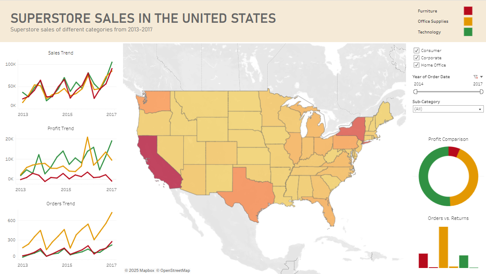

# **Hello there, I'm Justin!**

### Data Engineering/Data Modeling/Data Analysis

I am an aspiring data engineer/analyst with entry-level professional experience in application development. I mainly work with Python, Java, and SQL in various personal and academic projects. I graduated from Southern Arkansas University with a major in Computer Science and a minor in Mathematics. I enjoy collaborating with people and creating ideas!

### Core skills:
Python | Java | SQL | Data

### Find me on:

&nbsp;&nbsp;

&nbsp;&nbsp;

# ---

## **Projects**

### 1. Sales Insights using PowerBI

[GitHub Repo](https://github.com/aJustinOng/sales-insights-powerbi)

**Skills:**

SQL | DAX | Data Visualization

**Tools:**

MySQL Workbench | Microsoft Excel | PowerBI

**Overview:**  

I used MySQL Workbench and Excel to clean and ETL a sales dataset. I then used PowerBI to analyze and visualize the revenue and profit across different regions, customers, and markets. I learned to focus on the critical areas (profit rather than revenue, etc.) that a sales manager would be interested in to answer and tackle sales problems.

I used basic DAX to return specific data aggregates that could be used in visualizations. I also learned how to integrate the powerful interactive tools in PowerBI to allow my stakeholders to conveniently isolate data within specific conditions. I also took additional feedback to drastically improve my initial dashboard.

&nbsp;

### 2. Real Estate Price Prediction

[GitHub Repo](https://github.com/aJustinOng/real-estate-price-prediction)

**Skills:**

Python | NumPy | Pandas | Matplotlib | scikit-learn | HTML | CSS | JavaScript

**Tools:**

Jupyter Notebook | VS Code | PyCharm | Flask | Postman

**Overview:**

In this data science project, I cleaned and visualized a real estate dataset from Kaggle and used it to build a model with scikit-learn using linear regression. Next, I created a Python Flask server to run the model and receive GET and POST requests, which I tested using Postman. Lastly, I made a webpage using HTML, CSS, and JavaScript with a user-friendly UI, where the user can enter their desired house area (square feet), number of bedrooms and bathrooms, and state to get a predicted price.

The model building section covers a majority of data science concepts like data cleaning, outlier removal, feature engineering, dimensionality reduction, one hot encoding, and K-Fold cross-validation.

&nbsp;

### 3. KAMI (Kitchen Assistant and Meal Innovator) - AI Recipe Generator

**Skills:**

Project Management | Python | SQL | Data Modeling | AI Prompt Modeling | HTML | CSS | JavaScript

**Tools:**

Django | XAMPP MySQL | GPT-4 | DALLE-3

**Overview:**  

This senior capstone project was carried out across two semesters (roughly 9 months) with two of my buddies. We met twice a week physically to discuss our individual and collaborative progress with our senior project advisor. Other forms of communication and collaboration was done through Discord, Google Docs, and Google Slides.

The main focus of the project was to make an AI-based recipe generator that functions by feeding it with available ingredients and establishing limits or constraints to the dish. We integrated this into a website that 'invents' new recipes by considering the user's dietary needs and choice of cuisine.

The recipe's ingredients, instructions, and AI-generated image are displayed to the user. The project utilized OpenAI's GPT-4 and DALLE-3 APIs into a Django Framework that is connected to a local database.

I fully designed the webpage using HTML, CSS, and JavaScript. I also engineered the entire database that handled the many-to-many relationships between users and their available ingredients, preferences, and generated recipes. The database was hosted on a local XAMPP MySQL database. Unfortunately, we took the demo website offline due to its costs.

# ---

## **Work Experience**

### App Dev Intern @ J.B. Hunt Transport

In this paid, in-person internship, I participated in multiple 2-week sprints with a full-time backend team. We focused on updating and maintaining the 360 Shipper application, where I was assigned stories on EUM calls cleanup, removing and replacing legacy code with modern APIs.

The application was based on the Java Spring Boot framework, and we used Git requests to collaborate through Azure DevOps Services. We also utilized Postman API and Dynatrace to test our services.

What I did:

- Participated in multiple 2-week sprints with a full-time backend team.  
- Updated and maintained the 360 Shipper application.  
- EUM calls cleanup, removing and replacing legacy code with modern APIs.  
- Application was based on a Java Spring Boot framework.  
- Collaboration through Azure DevOps Services with Git.  
- Utilized Postman API and Dynatrace to test services.  

&nbsp;

### CS Research Assistant @ Southern Arkansas University

I assisted in several machine learning research projects, specifically ViT (vision transformers) object detection. Python and its libraries (Tensorflow, Keras, PyTorch, CUDA) were utilized for our projects.

What I did:

- Assisted in several research projects with a focus on machine learning.  
- Object detection/classification.  
- Worked with ViT (vision transformers) and YOLOv8.  
- Utilized Python tools in projects.  
- Image/label dataset cleanup.  

&nbsp;

### Peer Tutor @ Southern Arkansas University

In the Academic Enrichment Center, I worked as an in-person supplemental tutor to peers, providing tailored support to individuals who required assistance in mastering their course material. This role trained my communication and leadership skills.

What I did:

- Worked as an in-person supplementary tutor.  
- Provided tailored support to individuals who required assistance in mastering their course material.  
- Computer Science, Math, Physics, and English.  

# ---

## **Skills**

### Data Visualization

The following is a simple interactive data visualization of the wages of computer science jobs between 2020-2023. I created this while learning and experimenting with Tableau.

  

Here's my simple take on the classic Tableau Sample Superstore dataset:

  

As a research assistant, I had to explore different ways of visualizing data. I utilized Python libraries and Jupyter Notebook during our machine learning projects.

&nbsp;

### Technical Writing

I believe that technical writing skills are vital in the Computer Science field, to report documents professionally. I have written some technical documents outside of my CS projects to develop these skills.

During my Technical Writing class, I wrote a sample proposal where I sent out digital surveys on a potential product and fully analyzed and researched that topic with both primary and secondary sources. Then I designed the proposal in an aesthetic yet informative document.

  

I also had the opportunity to write a sample memorandum to my professor, analyzing the technical effectiveness of a particular product I was familar with.  

  

<a href="assets/pdfs/ProposalKiosk.pdf" target="_blank">Sample Proposal</a>  
<a href="assets/pdfs/ProjectMemorandum.pdf" target="_blank">Sample Memorandum</a>  
<a href="assets/pdfs/ProjectRecommendationLetter.pdf" target="_blank">Sample Recommendation Letter</a>  

# ---

## **Education**

### Southern Arkansas University

Bachelor of Science in Computer Science: Cyber Security and Privacy Option, Minor in Mathematics, 4.00GPA

Honors College, International Students Association

- High-level languages like Python, Java, C++  
- Tools like Git and Linux  
- Both solo and collaborative academic/research projects  
- Poster/slide presentations in both internal and external events  
- SQL database design and management  
- Cybersecurity-related classes (Cyber Defense, Cyber Forensics, Network Security, etc.)  

&nbsp;

### Arkansas Summer Research Institute 2023

A virtual two-week professional development event hosted by Arkansas NSF EPSCoR, where partipants learn technical and professional skills in the data science field.

- Solo data science project from given datasets  
- Problem definition, data cleaning, data analysis, evalution, and visualization  
- Virtual project presentation through Zoom  
- Mentorship from various professionals in the data-science field  

# ---

## **Other things about me**

In my free time, I like do digital art and animations. Creative projects have always been my interest.

I had the opportunity to design the logo/mascot of my Senior capstone project, where I even created a .gif animation consisting of 16 hand-drawn frames.

Animation frames:

<!--
Other examples of my digital art works that were created through Clip Studio Paint, a digital graphics software:

  
  
  
-->