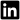

# **Hello there, I'm Justin!**

### Developer/Artist/Creator

I am an aspiring software engineer with entry-level professional experience in application development. I have worked with Java, Python, and C++. I am currently a Senior at Southern Arkansas University, with a major in Computer Science and a minor in Mathematics.

### Find me on:

&nbsp;&nbsp;

&nbsp;&nbsp;

# ---

## **Work Experience**

### App Dev Intern @ J.B. Hunt Transport

Over the course of a two-month long internship, I was assigned multiple stories relating to maintaining and updating a shipping/booking application. I worked closely with a mentor within a full-time team and participated in their two-week sprints.

The application used Java in a Spring Boot architecture and was deployed into Azure Dev Ops pipelines.

### CS Research Assistant @ Southern Arkansas University

Assisting my professor in research projects, with a focus on ViT (vision transformers) object detection. Primarily using Python and its libraries.

### Peer Tutor @ Southern Arkansas University

In-person supplemental tutoring to peers for classes I have previously taken such as Computer Science, Calculus, and Physics.

# ---

## **Projects**

### **KAMI (Kitchen Assistant and Meal Innovator) - AI Recipe Generator**

This capstone project's main focus was to make an AI-based recipe generator that functions by feeding it with available ingredients and establishing limits or constraints to the dish. We integrated this into a website that 'invents' new recipes by considering the user's dietary needs and choice of cuisine.

The recipe's ingredients, instructions, and AI-generated image are displayed to the user. The project implemented OpenAI's GPT-4 and DALLE-3 APIs into a Django Framework that is connected to a local MySQL database.

<a href="pdfs/KAMI Report.pdf" target="_blank">[Read more]</a>

&nbsp;

### **LLM SPAM or HAM Classification**

As an Honors project for my Cyber Forensics class, I decided to test the ability of different LLMs (Large Language Models) to classify spam emails in a zero-shot environment. Five models—Llama2, Mistral, Synthia, Zephyr, and CausalLM—were given the same dataset of spam and ham emails and instructed to classify them accordingly.

I downloaded and hosted the models on LM Studio and used the OpenAI API to connect them to a Python .ipynb notebook.

<a href="pdfs/Harnessing AI Cognition.pdf" target="_blank">[Read more]</a>

# ---

## **Education**

### Southern Arkansas University

Bachelor of Science in Computer Science: Cyber Security and Privacy Option, Minor in Mathematics, 4.00GPA

Honors College, International Students Association

# ---

## **Other things about me**
In my free time, I like do digital art and animations. I had a lot of fun designing the logo/mascot of my team's capstone project in my Senior year, where I even created a .gif animation consisting of 16 hand-drawn frames.

<!--  -->

<!--  -->

